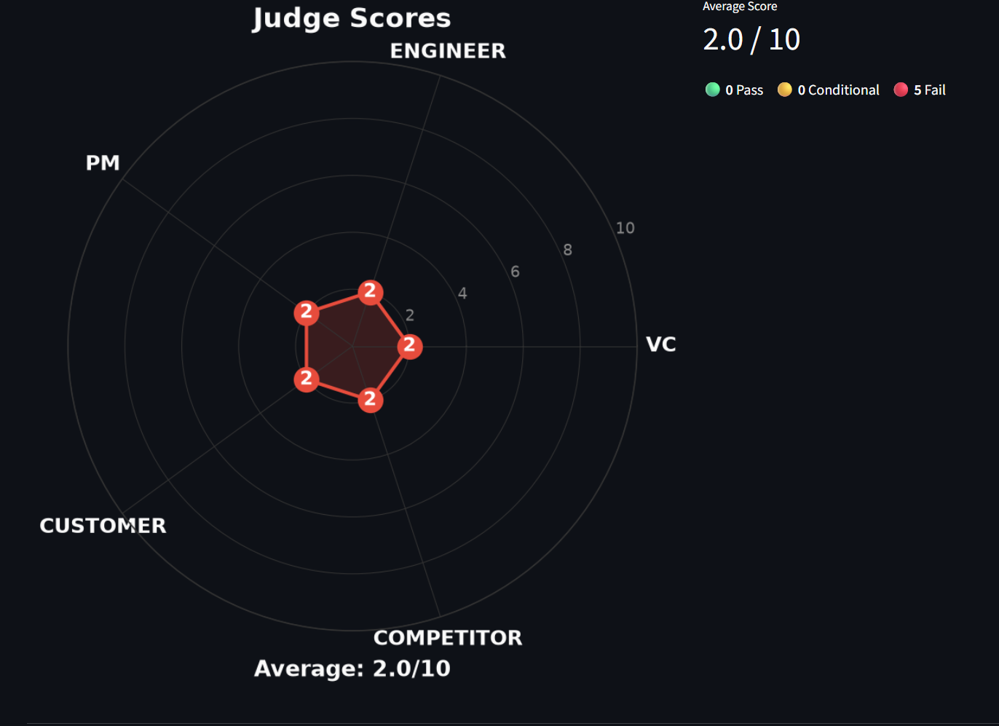
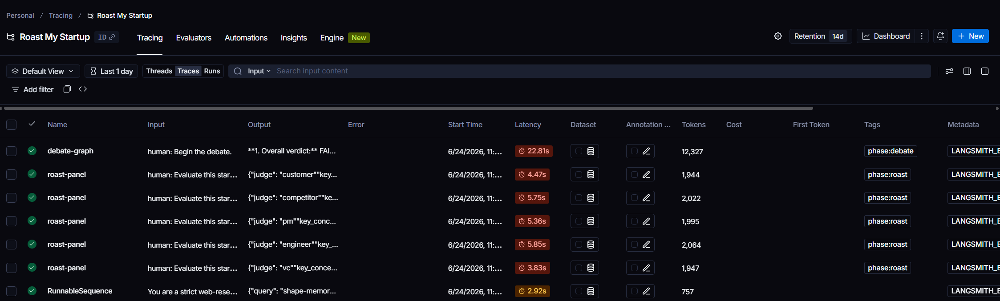

# Roast My Startup

> **Five AI judges. One verdict. Zero sugarcoating.**

Submit a startup idea and get torn apart, constructively, by a VC, engineer, product manager, customer, and competitor. Each judge scores independently, they debate across multiple rounds, and a moderator delivers the final call. Disagree? **Appeal with evidence** and make them reconsider.


| | |
| :--- | :--- |
| **Roast panel** | Five parallel verdicts: score, pass/fail, roast, key concern |
| **Debate** | Multi-round LangGraph argument with token streaming and every judge on the record |
| **Synthesis** | Moderator ties it together into a final verdict |
| **Appeal** | Founder rebuttal → revised scores and updated synthesis |
| **Memory** | Past ideas inform future roasts (compact summaries; optional semantic retrieval) |

## Quick start

**Requirements:** Python 3.11+ · [Ollama](https://ollama.com/) (local) or DeepSeek API (cloud)

```bash
git clone https://github.com/notsubash/roast-my-startup-idea.git
cd roast-my-startup-idea
pip install -r requirements.txt
ollama pull qwen3.5:9b          # default chat model; override in .env
ollama pull nomic-embed-text    # only if ENABLE_SEMANTIC_MEMORY=true
cp .env.example .env            # optional: DeepSeek, Tavily, LangSmith, semantic memory
streamlit run src/app.py
```

Open the app, paste your pitch (optional details help judges), choose the model (local or foundation model), and hit **Roast It!**

### Streaming API (custom frontend)

Run the FastAPI backend separately from Streamlit:

```bash
uvicorn api.app:app --app-dir src --reload --port 8000
```

Endpoints:

| Method | Path | Purpose |
| --- | --- | --- |
| `GET` | `/health` | Liveness check |
| `POST` | `/api/runs` | Create a run, returns `run_id` immediately |
| `GET` | `/api/runs/{run_id}` | Poll run status |
| `GET` | `/api/runs/{run_id}/events` | SSE stream of roast/debate events |

Create a run, then open an `EventSource` (or equivalent) on `/api/runs/{run_id}/events`. The stream emits ordered envelopes ending in `run_completed` or `run_failed`.

The run engine is decoupled from the HTTP connection: `RunManager` drives the pipeline once into a durable SQLite event log (`data/runs.db`). Multiple tabs can watch the same run; disconnect and reconnect with the SSE `Last-Event-ID` header to resume without gaps. Heartbeat comment frames keep idle connections alive (`SSE_HEARTBEAT_SECONDS`, default 15s).

Set `ROAST_CORS_ORIGINS` in `.env` for your frontend origin (comma-separated). Default: `http://localhost:3000,http://127.0.0.1:3000`.

Run uvicorn with a single worker per machine; background tasks and in-process subscribers are not coordinated across workers yet.

## What it does

| Phase | What happens |
| --- | --- |
| **Roast panel** | Five judges (VC, Engineer, PM, Customer, Competitor) evaluate in parallel |
| **Debate** | LangGraph runs configurable multi-round debate with fixed turn order and live token streaming |
| **Synthesis** | Moderator produces a final summary |
| **Appeal** *(optional)* | Founder rebuttal → judges revise scores → updated synthesis |
| **Memory** | Prior ideas summarized into future judge prompts (SQLite, session-scoped; optional semantic retrieval) |

Each judge returns structured output: score, pass/fail/conditional label, roast, and key concern. The UI renders a radar chart, debate transcript, and Markdown export.

## Screenshots

| Individual verdicts | Judge scores radar |
| --- | --- |
|  |  |

| Debate round 1 | Debate round 2 | Debate round 3 |
| --- | --- | --- |
|  |  |  |

| Final synthesis | Appeal mode | After appeal synthesis |
| --- | --- | --- |
|  |  |  |

## Architecture

Built with **LangGraph**, **LangChain**, **Ollama**, and the **DeepAgents SDK**. Two execution paths exist; only one is production-ready.

```text
User idea
  → Phase 1: parallel structured judge calls (roast panel)
  → Phase 2: LangGraph debate graph
  → Moderator synthesis
  → Optional appeal re-evaluation
  → Persist compact idea memory
```

**Deterministic pipeline** (`src/pipeline.py`): Direct model calls plus LangGraph guarantee all five judges speak, debate rounds advance predictably, and Pydantic validates every boundary. Debate streams token deltas (`DebateTokenDelta`) for live UI updates.

**Run engine** (`src/api/run_manager.py`): Background task per run, durable event log in SQLite, subscriber-based SSE with reconnect support.

**DeepAgents orchestrator** (`src/orchestrator/deep_agent.py`): Agent harness that dispatches subagents via `task()` with stronger tool-calling models. Not the default user path.

### Design principles

- **Orchestration over autonomy:** the debate is a workflow, not a free-form agent task. LangGraph owns state and routing.
- **Structured output at boundaries:** verdict schemas in `src/judges/schemas.py` are the contract between phases, charts, memory, and exports. Post-validation guardrails in `src/judges/guardrails.py` reject score/verdict mismatches and degenerate panels.
- **Untrusted user input:** startup idea, memory, research, and appeal text are wrapped in tagged blocks with delimiter escaping (`src/idea_context.py`); prompts treat that content as data, not instructions.
- **Compact memory:** SQLite stores full records, but prompts receive only short summaries (scores, concerns, synthesis). Full transcripts are never injected into judge prompts; local models drift under long context. Optional semantic retrieval (`sqlite-vector`) surfaces similar past ideas instead of only the most recent.
- **Appeal as a third phase:** re-evaluates judges against founder evidence. Does not rerun the multi-round debate.

## Configuration

Copy `.env.example` to `.env`. Key variables:

```bash
LOCAL_MODEL=ollama:qwen3.5:9b
DEEPSEEK_MODEL=deepseek-v4-pro
DEEPSEEK_BASE_URL=https://api.deepseek.com
DEEPSEEK_API_KEY=your_deepseek_api_key
MAX_DEBATE_ROUNDS=3
ENABLE_WEB_SEARCH=false
WEB_SEARCH_MAX_RESULTS=3
TAVILY_API_KEY=your_tavily_api_key
ROAST_CORS_ORIGINS=http://localhost:3000,http://127.0.0.1:3000
SSE_HEARTBEAT_SECONDS=15
STALE_RUN_MINUTES=30
RUNS_DB_PATH=data/runs.db
ENABLE_SEMANTIC_MEMORY=false
EMBEDDING_MODEL=ollama:nomic-embed-text
EMBEDDING_DIMENSION=768
```

| Runtime | When to use |
| --- | --- |
| `local` | Default. Ollama via `LOCAL_MODEL`. |
| `deepseek` | Cloud API via `DEEPSEEK_API_KEY` and `langchain_deepseek`. |

Pick a model with solid instruction-following and structured output. If verdict validation fails, try a stronger instruct or tool-calling model.

**Web research:** optional Tavily search, gated by a model policy prompt (not keyword matching).

**Semantic memory:** set `ENABLE_SEMANTIC_MEMORY=true` and pull the embedding model (`ollama pull nomic-embed-text` by default). When enabled, similar past ideas are retrieved via `sqlite-vector`; otherwise memory falls back to recency.

## LangSmith observability

Tracing is opt-in. Set credentials in `.env`:

```bash
LANGSMITH_TRACING=true
LANGSMITH_API_KEY=your_langsmith_api_key
LANGSMITH_PROJECT=roast-my-startup
```

Legacy `LANGCHAIN_TRACING_V2`, `LANGCHAIN_API_KEY`, and `LANGCHAIN_PROJECT` are also supported.

Traces cover roast panel calls, LangGraph debate, appeal flows, and experimental DeepAgents runs. Metadata includes execution flow, app version, and a privacy-safe `idea_fingerprint` (SHA-256 hash + 80-char preview). Full startup text is never sent.

Filter by tags such as `phase:roast`, `phase:debate`, `phase:appeal`, or `flow:deterministic`.



## Using the app

1. Enter a startup idea (optionally expand **Optional details** for target customer, pricing, traction, and competitors).
2. Choose execution flow: **Deterministic (production)** or **DeepAgents (experimental)**.
3. Choose model runtime: **local** or **deepseek**.
4. Optionally enable **Web research (Tavily)**.
5. Review verdicts, radar chart, debate transcript, and synthesis.
6. Use **Appeal Mode** with concrete evidence (LOIs, pilots, buyer persona, not persuasion alone).
7. Download the Markdown transcript if needed.

### Memory

Stored at `data/ideas.db`, scoped to the Streamlit session user id. Retrieval (`src/memory/retrieval.py`) prefers semantically similar past ideas when `ENABLE_SEMANTIC_MEMORY=true`; otherwise it uses the most recent entries. Context builder (`src/memory/context.py`) injects compact summaries (idea text, average score, top concerns, previous synthesis, appeal outcome). Full transcripts are never injected.

### Appeal mode

Founder appeal is sent to all five judges with the original idea, their prior verdict, moderator synthesis, optional memory context, and appeal text. Each judge returns a fresh validated `Verdict`; the UI shows score deltas.

## Repository layout

```text
src/
  app.py                         Streamlit entry point
  api/                           FastAPI streaming API (RunManager, durable SSE log)
  pipeline.py                    Frontend-agnostic production pipeline
  config.py                      Model and app settings
  events.py                      Frontend-agnostic pipeline event types
  idea_context.py                Untrusted user-input wrapping for prompts
  judges/                        Schemas, guardrails, single-judge service, parallel panel
  debate/                        LangGraph graph, nodes, router, state
  memory/                        SQLite store, semantic retrieval, compact prompt context
  appeal/                        Re-evaluation and synthesis
  orchestrator/deep_agent.py     Experimental DeepAgents path
  observability/langsmith.py     LangSmith bootstrap and run config
  ui/streamlit_runner.py         Streamlit event-stream adapters
  utils/                         Parser fallback, radar chart, transcript export
tests/                           Unit tests (unittest, fake models, no Ollama required)
evals/                           Regression evals and monthly audit (see evals/README.md)
```

## Development

```bash
pip install -r requirements-dev.txt
pre-commit install                # Ruff on every commit

python -m unittest discover -s tests
python -m compileall src
ruff check src tests evals
ruff format src tests evals
```

**CI** (`.github/workflows/ci.yml`) runs on push/PR to `main`: Ruff lint and format, pinned deps, version resolution check, unit tests on Python 3.11-3.13, compile check.

**Evals:** see [evals/README.md](evals/README.md).

| Tier | When | Command |
| --- | --- | --- |
| 0 (CI) | Every PR | `python -m unittest discover -s tests` |
| 1 (Local) | Before prompt/model changes | `python -m evals.run_eval --runtime local --full` |
| 2 (DeepSeek audit) | Monthly (1st) or manual | `python -m evals.run_audit --no-reuse-last-local --baseline-only` |

Tier 1 checks structural reliability ($0, Ollama). Tier 2 uses one DeepSeek LLM-as-judge call per idea (~$0.50-2/month on committed baselines).

Version lives in `pyproject.toml` (`[project].version`); runtime reads it via `src/version.py`.

## Scope and limitations

Honest boundaries, not bugs. Current design:

- Memory identity is session-local, not account-based. Semantic retrieval is optional and local-only.
- Appeal re-evaluates judges; it does not run a second multi-round debate.
- SQLite storage is local-only (`data/ideas.db` for memory, `data/runs.db` for API runs).
- Streamlit is the reference UI; the streaming API covers roast/debate only (no memory or appeal yet).
- API runs need a single uvicorn worker per machine; multi-worker coordination is not implemented.
- DeepAgents is experimental, not the production orchestrator.

## Generated artifacts

```text
data/ideas.db
data/runs.db
transcripts/*.md
roast_radar.png
```

Runtime outputs. Keep out of commits unless you intentionally want samples.